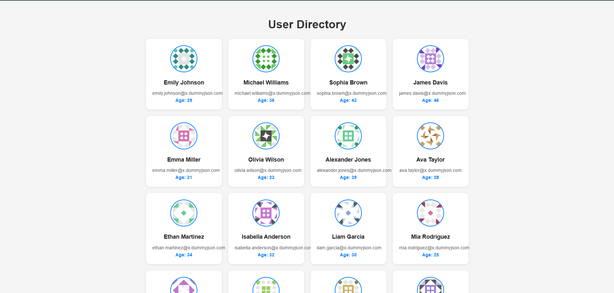

# 🚀 React Shimmer Fetch

A simple and modern React app that fetches user data from an API and displays it with a smooth **shimmer (skeleton) loading effect**, just like YouTube or Google.

---

## 🌐 Live Preview
👉 **[https://sudhanshuverse.github.io/react-shimmer-fetch/](https://sudhanshuverse.github.io/react-shimmer-fetch/)**  

---

## 🖼️ Screenshot
|  
---

## ⚙️ Features

- 🔹 Fetches live user data from [https://dummyjson.com/users](https://dumyjson.com/users)  
- 🔹 Smooth shimmer (skeleton) loader effect  
- 🔹 Responsive card layout  
- 🔹 Clean and minimal UI  
- 🔹 Easy to deploy on GitHub Pages  

---

## 🛠️ Tech Stack

- **React.js**
- **CSS3 (Custom Shimmer Loader)**
- **Fetch API**

---